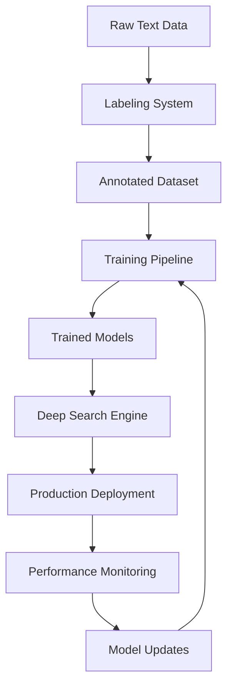

# PII Detection Learning & Training Manual

A comprehensive guide to the machine learning pipeline for PII detection, covering data labeling, model training, deployment, and continuous improvement processes.

## 📋 Table of Contents

1. [Overview](#overview)
2. [System Architecture](#system-architecture)
3. [Deep Search Labeling System](#deep-search-labeling-system)
4. [Model Training Pipeline](#model-training-pipeline)
5. [Deep Search Engine Deployment](#deep-search-engine-deployment)
6. [Context Search Engine Setup](#context-search-engine-setup)
7. [End-to-End Workflow](#end-to-end-workflow)
8. [Data Management](#data-management)
9. [Model Evaluation & Metrics](#model-evaluation--metrics)
10. [Production Deployment](#production-deployment)
11. [Monitoring & Maintenance](#monitoring--maintenance)
12. [Advanced Configuration](#advanced-configuration)
13. [Troubleshooting](#troubleshooting)
14. [Best Practices](#best-practices)

## 🎯 Overview

The PII detection learning system is a comprehensive machine learning pipeline designed to create, train, and deploy models for identifying personally identifiable information in text. The system consists of four main components:

### Core Components

1. **Deep Search Labeling System** 🏷️
   - Web-based annotation interface
   - Multi-user collaboration support
   - Quality control and conflict resolution
   - Export capabilities for multiple formats

2. **Model Training Pipeline** 🔧
   - Automated data preprocessing
   - Multiple ML algorithm support
   - Hyperparameter optimization
   - Cross-validation and evaluation

3. **Deep Search Engine** 🚀
   - Production ML inference server
   - RESTful API endpoints
   - Model versioning and management
   - Performance monitoring

4. **Context Search Engine** 🧠
   - LLM-powered context validation
   - Ollama integration
   - Advanced reasoning capabilities
   - Final verification layer

### Learning Process Flow



## 🏗️ System Architecture

### Component Overview

```
┌─────────────────────────────────────────────────────────────────┐
│                    PII Learning System                          │
├─────────────────┬─────────────────┬─────────────────────────────┤
│  Labeling UI    │  Training       │    Production Engines       │
│  Port: 3002     │  Pipeline       │                             │
│                 │                 │  ┌─────────┬─────────────┐   │
│  ┌─────────────┐│  ┌─────────────┐│  │Deep     │Context      │   │
│  │Annotation   ││  │Data Prep    ││  │Search   │Search       │   │
│  │Interface    ││  │& Training   ││  │:8000    │:8001        │   │
│  └─────────────┘│  └─────────────┘│  └─────────┴─────────────┘   │
│                 │                 │                             │
│  ┌─────────────┐│  ┌─────────────┐│  ┌─────────────────────────┐   │
│  │Quality      ││  │Model        ││  │Model Management         │   │
│  │Control      ││  │Evaluation   ││  │& Versioning             │   │
│  └─────────────┘│  └─────────────┘│  └─────────────────────────┘   │
└─────────────────┴─────────────────┴─────────────────────────────┘
```

### Data Flow Architecture

1. **Raw Text** → **Labeling System** → **Annotated Dataset**
2. **Annotated Dataset** → **Training Pipeline** → **Trained Models**
3. **Trained Models** → **Deep Search Engine** → **Production API**
4. **Production Feedback** → **Model Updates** → **Continuous Improvement**

## 🏷️ Deep Search Labeling System

### Quick Setup

```bash
# Navigate to labeling directory
cd deep_search_labeling

# Run automated setup
./setup.sh

# Start backend (Terminal 1)
cd backend
source venv/bin/activate
python start.py

# Start frontend (Terminal 2)
cd frontend
npm start

# Access interface at http://localhost:3002
```

### System Features

#### Multi-User Collaboration
- **User Management**: Role-based access control
- **Project Sharing**: Team collaboration on datasets
- **Real-time Updates**: Live annotation synchronization
- **Conflict Resolution**: Automated disagreement detection

#### Advanced Annotation Tools
- **Smart Highlighting**: Context-aware entity suggestions
- **Batch Operations**: Bulk annotation capabilities
- **Keyboard Shortcuts**: Efficient annotation workflow
- **Undo/Redo**: Complete action history

### Project Management

#### Creating a New Project

1. **Access the Interface**
   ```bash
   # Ensure services are running
   curl http://localhost:3002/health
   ```

2. **Project Configuration**
   - **Name**: Descriptive project identifier
   - **Description**: Detailed project objectives
   - **Entity Types**: Configure PII categories
     ```json
     {
       "entities": [
         {"name": "PERSON", "color": "#FF6B6B", "hotkey": "P"},
         {"name": "EMAIL", "color": "#4ECDC4", "hotkey": "E"},
         {"name": "PHONE", "color": "#45B7D1", "hotkey": "T"},
         {"name": "ADDRESS", "color": "#96CEB4", "hotkey": "A"}
       ]
     }
     ```

3. **Data Import Options**
   - **Text Files**: .txt, .csv, .json formats
   - **Batch Upload**: Multiple file processing
   - **API Integration**: Direct data streaming
   - **Sample Generation**: Synthetic data creation

### Annotation Workflow

#### Standard Annotation Process

1. **Text Selection**
   ```bash
   # Navigate through samples
   - Use arrow keys or pagination
   - Filter by completion status
   - Search specific content
   ```

2. **Entity Annotation**
   - **Highlight**: Select text spans with mouse
   - **Classify**: Assign entity type (hotkeys available)
   - **Confidence**: Set certainty level (0.0-1.0)
   - **Context**: Add explanatory notes

3. **Quality Assurance**
   - **Review Mode**: Double-check annotations
   - **Validation Rules**: Automated consistency checks
   - **Inter-annotator Agreement**: Statistical validation

#### Advanced Features

##### Smart Suggestions
```python
# Enable ML-assisted annotation
{
  "smart_suggestions": {
    "enabled": true,
    "confidence_threshold": 0.7,
    "suggestion_model": "spacy_en_core_web_sm",
    "auto_accept_threshold": 0.95
  }
}
```

##### Batch Operations
- **Find & Replace**: Pattern-based bulk updates
- **Entity Propagation**: Apply labels across similar instances
- **Validation Runs**: Batch quality checks

### Quality Control System

#### Multi-Annotator Setup

1. **User Assignment**
   ```sql
   -- Assign annotators to projects
   INSERT INTO project_assignments (project_id, user_id, role)
   VALUES (1, 'annotator_1', 'primary'),
          (1, 'annotator_2', 'validator'),
          (1, 'supervisor_1', 'reviewer');
   ```

2. **Agreement Metrics**
   - **Cohen's Kappa**: Inter-annotator reliability
   - **F1 Score**: Entity-level agreement
   - **Span Overlap**: Boundary agreement analysis

3. **Conflict Resolution**
   - **Automatic Detection**: Disagreement identification
   - **Resolution Interface**: Side-by-side comparison
   - **Escalation Rules**: Supervisor involvement

#### Quality Metrics Dashboard

```python
# Example quality metrics
quality_report = {
    "inter_annotator_agreement": 0.85,
    "annotation_speed": "45 entities/hour",
    "consistency_score": 0.92,
    "coverage_completeness": 0.98,
    "entity_distribution": {
        "PERSON": 0.35,
        "EMAIL": 0.25,
        "PHONE": 0.20,
        "ADDRESS": 0.20
    }
}
```

### Data Export & Integration

#### Export Formats

##### HuggingFace Datasets (Recommended)
```python
# Export configuration
export_config = {
    "format": "huggingface",
    "split_ratios": {"train": 0.7, "validation": 0.15, "test": 0.15},
    "quality_threshold": 0.8,
    "include_metadata": True,
    "tokenization": "word_level"
}
```

##### spaCy Training Format
```python
# spaCy format export
{
    "format": "spacy",
    "version": "3.4",
    "entity_types": ["PERSON", "EMAIL", "PHONE"],
    "include_context": True
}
```

##### Custom JSON Format
```json
{
  "documents": [
    {
      "id": "doc_001",
      "text": "Contact John Doe at john@example.com",
      "entities": [
        {
          "start": 8,
          "end": 16,
          "label": "PERSON",
          "confidence": 0.95,
          "annotator": "user_1"
        }
      ],
      "metadata": {
        "source": "customer_emails",
        "language": "en",
        "timestamp": "2024-01-15T10:30:00Z"
      }
    }
  ]
}
```

#### Export Process

1. **Quality Validation**
   ```bash
   # Run pre-export validation
   python scripts/validate_annotations.py --project-id 1 --min-confidence 0.7
   ```

2. **Export Generation**
   ```bash
   # Generate export file
   python scripts/export_data.py \
     --project-id 1 \
     --format huggingface \
     --output ./exports/project_1_dataset.json
   ```

3. **Quality Report**
   ```bash
   # Generate quality report
   python scripts/quality_report.py --export-file ./exports/project_1_dataset.json
   ```

## 🔧 Model Training Pipeline

### Training Architecture

```
┌─────────────────┐    ┌─────────────────┐    ┌─────────────────┐
│  Labeled Data   │───►│ Data Processing │───►│ Model Training  │
│  (JSON/CSV)     │    │ & Validation    │    │ & Evaluation    │
└─────────────────┘    └─────────────────┘    └─────────────────┘
         │                       │                       │
         ▼                       ▼                       ▼
┌─────────────────┐    ┌─────────────────┐    ┌─────────────────┐
│ Quality Checks  │    │ Feature         │    │ Model           │
│ & Statistics    │    │ Engineering     │    │ Optimization    │
└─────────────────┘    └─────────────────┘    └─────────────────┘
```

### Data Preparation Pipeline

#### 1. Data Import & Validation

```bash
# Create training data directory
mkdir -p deep_search_engine/data/{raw,processed,splits}

# Copy exported data
cp deep_search_labeling/exports/project_*.json deep_search_engine/data/raw/

# Validate data integrity
python src/data_validation.py \
  --input data/raw/project_dataset.json \
  --output data/validation_report.json
```

#### 2. Data Preprocessing

```python
# preprocessing_config.json
{
  "text_processing": {
    "lowercase": false,
    "remove_punctuation": false,
    "normalize_whitespace": true,
    "handle_unicode": true
  },
  "entity_processing": {
    "merge_overlapping": true,
    "validate_boundaries": true,
    "filter_min_length": 2
  },
  "language_processing": {
    "detect_language": true,
    "language_specific_rules": true,
    "handle_mixed_languages": true
  }
}
```

#### 3. Dataset Splitting Strategy

```bash
# Advanced data splitting
python src/data_preparation.py \
  --input data/raw/project_dataset.json \
  --output data/processed/ \
  --split-strategy stratified \
  --train-ratio 0.7 \
  --val-ratio 0.15 \
  --test-ratio 0.15 \
  --random-seed 42 \
  --ensure-entity-coverage
```

### Training Configuration

#### Model Architecture Options

##### 1. Traditional ML Pipeline
```json
{
  "model_type": "sklearn_pipeline",
  "vectorizer": {
    "type": "tfidf",
    "max_features": 10000,
    "ngram_range": [1, 3],
    "analyzer": "word",
    "stop_words": "english"
  },
  "classifier": {
    "type": "logistic_regression",
    "C": 1.0,
    "max_iter": 1000,
    "class_weight": "balanced"
  }
}
```

##### 2. Deep Learning Pipeline
```json
{
  "model_type": "transformer",
  "base_model": "distilbert-base-uncased",
  "architecture": {
    "hidden_size": 768,
    "num_attention_heads": 12,
    "num_hidden_layers": 6,
    "dropout": 0.1
  },
  "training": {
    "learning_rate": 2e-5,
    "batch_size": 16,
    "epochs": 10,
    "warmup_steps": 500
  }
}
```

##### 3. Hybrid Ensemble
```json
{
  "model_type": "ensemble",
  "models": [
    {"type": "sklearn_pipeline", "weight": 0.3},
    {"type": "transformer", "weight": 0.5},
    {"type": "rule_based", "weight": 0.2}
  ],
  "combination_strategy": "weighted_voting"
}
```

### Training Execution

#### 1. Environment Setup

```bash
# Create training environment
cd deep_search_engine
python -m venv training_env
source training_env/bin/activate

# Install training dependencies
pip install -r requirements_training.txt

# Verify GPU availability (optional)
python -c "import torch; print(f'CUDA available: {torch.cuda.is_available()}')"
```

#### 2. Training Process

```bash
# Start training with monitoring
python src/train.py \
  --config config/training_config.json \
  --data-dir data/processed/ \
  --output-dir models/experiment_001/ \
  --log-level INFO \
  --save-checkpoints \
  --early-stopping
```

#### 3. Training Monitoring

```python
# Real-time training metrics
training_metrics = {
    "epoch": 5,
    "train_loss": 0.234,
    "val_loss": 0.267,
    "train_f1": 0.892,
    "val_f1": 0.876,
    "learning_rate": 1.5e-5,
    "entities_per_second": 1250,
    "memory_usage": "2.3GB",
    "estimated_time_remaining": "45 minutes"
}
```

### Hyperparameter Optimization

#### Automated Hyperparameter Search

```python
# hyperparameter_search.py
from optuna import create_study

search_space = {
    "learning_rate": [1e-5, 5e-5, 1e-4],
    "batch_size": [8, 16, 32],
    "dropout": [0.1, 0.2, 0.3],
    "weight_decay": [0.01, 0.001, 0.0001]
}

# Run optimization
python src/hyperparameter_search.py \
  --search-space config/search_space.json \
  --n-trials 50 \
  --optimization-metric f1_macro
```

#### Cross-Validation Strategy

```bash
# K-fold cross-validation
python src/cross_validation.py \
  --config config/training_config.json \
  --k-folds 5 \
  --stratified \
  --parallel-jobs 2
```

### Model Evaluation Framework

#### Comprehensive Evaluation Metrics

```python
# evaluation_results.json
{
  "overall_metrics": {
    "precision": 0.89,
    "recall": 0.87,
    "f1_score": 0.88,
    "accuracy": 0.92
  },
  "entity_level_metrics": {
    "PERSON": {"precision": 0.91, "recall": 0.89, "f1": 0.90, "support": 1250},
    "EMAIL": {"precision": 0.95, "recall": 0.93, "f1": 0.94, "support": 890},
    "PHONE": {"precision": 0.87, "recall": 0.85, "f1": 0.86, "support": 670},
    "ADDRESS": {"precision": 0.83, "recall": 0.81, "f1": 0.82, "support": 540}
  },
  "confusion_matrix": "confusion_matrix.png",
  "error_analysis": "error_analysis.html"
}
```

#### Model Comparison Dashboard

```bash
# Generate comparison report
python src/model_comparison.py \
  --models models/experiment_001,models/experiment_002,models/baseline \
  --test-data data/processed/test.json \
  --output reports/model_comparison.html
```

## 🚀 Deep Search Engine Deployment

### Production Setup

```bash
# Navigate to deep search directory
cd deep_search_engine

# Run automated setup
./setup.sh

# Install production dependencies
pip install -r requirements.txt

# Download language models (optional)
python -m spacy download en_core_web_sm
python -m spacy download ko_core_news_sm

# Start production server
python start.py
```

### Model Management

#### Model Loading & Versioning

```python
# Model configuration
model_config = {
    "active_model": "pii_detector_v2.1",
    "model_path": "./models/active/",
    "backup_models": ["pii_detector_v2.0", "pii_detector_v1.9"],
    "auto_fallback": True,
    "performance_threshold": 0.85
}
```

#### Hot Model Swapping

```bash
# Deploy new model without downtime
python scripts/deploy_model.py \
  --model-path ./models/versions/pii_detector_v2.2.pkl \
  --validation-data ./data/validation.json \
  --rollback-threshold 0.80
```

### API Endpoints

1. **Search Endpoint**
   - URL: `POST /search`
   - Purpose: Detect PII in provided text
   - Request body:
     ```json
     {
       "text": "Hello, my name is John Doe and my email is john@example.com",
       "model": "en_pii_detector",
       "confidence_threshold": 0.7
     }
     ```
   - Response:
     ```json
     {
       "entities": [
         {
           "text": "John Doe",
           "type": "NAME",
           "start": 18,
           "end": 26,
           "confidence": 0.95
         },
         {
           "text": "john@example.com",
           "type": "EMAIL",
           "start": 41,
           "end": 57,
           "confidence": 0.99
         }
       ]
     }
     ```

2. **Training Endpoint**
   - URL: `POST /train`
   - Purpose: Train or fine-tune models
   - Request body:
     ```json
     {
       "dataset_path": "data/training/your_export.json",
       "config_path": "config/training_config.json",
       "output_model_name": "custom_pii_detector"
     }
     ```

3. **Models Endpoint**
   - URL: `GET /models`
   - Purpose: List available models
   - Response:
     ```json
     {
       "models": [
         {
           "name": "en_pii_detector",
           "language": "en",
           "entity_types": ["NAME", "EMAIL", "PHONE", "ADDRESS"],
           "version": "1.0.0"
         }
       ]
     }
     ```

## End-to-End Workflow

### Step 1: Create Labeled Dataset
1. Set up the deep search labeling system
2. Create a new project
3. Annotate text samples with PII entities
4. Export labeled data in HuggingFace format

### Step 2: Train Model
1. Place exported data in deep_search_engine/data directory
2. Configure training parameters
3. Run the training process
4. Evaluate model performance

### Step 3: Deploy Model
1. Start the deep search engine
2. Use the API to detect PII in new text

### Step 4: Continuous Improvement
1. Identify misclassifications and edge cases
2. Create new labeled data for these cases
3. Retrain or fine-tune the model
4. Deploy the improved model

## Troubleshooting

### Deep Search Labeling Issues

- **Problem**: Annotators have low agreement scores
  - **Solution**: Review and clarify annotation guidelines

- **Problem**: Export fails
  - **Solution**: Check export format compatibility and file permissions

### Training Issues

- **Problem**: Training loss doesn't decrease
  - **Solution**: Adjust learning rate or batch size in training config

- **Problem**: Model has poor performance on certain entity types
  - **Solution**: Add more training examples for those entity types

### Deep Search Issues

- **Problem**: API returns 500 error
  - **Solution**: Check logs in `deep_search_engine/logs/` for details

- **Problem**: Low confidence scores for known entities
  - **Solution**: Fine-tune model with more examples of those entities

## Best Practices

### Deep Search Labeling
- Ensure consistent annotation guidelines
- Use multiple annotators for quality control
- Balance entity types in training data
- Include diverse text samples

### Training
- Use appropriate validation metrics
- Monitor for overfitting
- Start with pre-trained language models
- Experiment with different architectures

### Deployment
- Set appropriate confidence thresholds
- Implement feedback loops for continuous improvement
- Monitor model performance over time
- Version control your models

---

This manual provides a foundation for implementing the PII detection learning process. Adjust the steps as needed based on your specific requirements and infrastructure.
